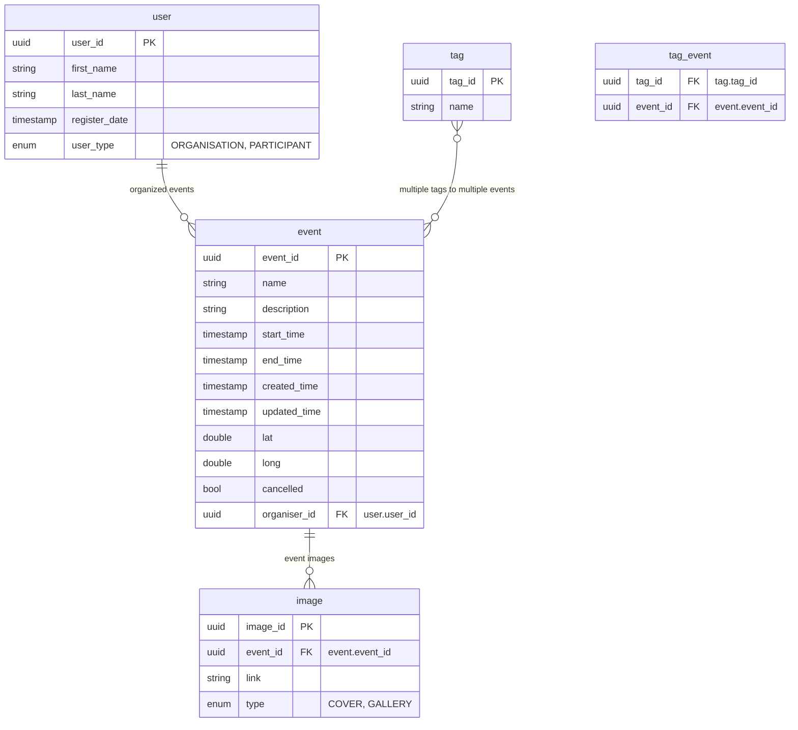

# Schemat bazy danych

```mermaid
erDiagram
    user {
        uuid user_id PK
        string first_name
        string last_name
        timestamp register_date
        enum user_type "ORGANISATION, PARTICIPANT"
    }

    event {
        uuid event_id PK
        string name
        string description
        timestamp start_time
        timestamp end_time
        timestamp created_time
        timestamp updated_time
        double lat
        double long
        bool cancelled
        uuid organiser_id FK "user.user_id"
    }

    image {
        uuid image_id PK
        uuid event_id FK "event.event_id"
        string link
        enum type "COVER, GALLERY"
    }

    tag {
        uuid tag_id PK
        string name
    }

    tag_event {
        uuid tag_id FK "tag.tag_id"
        uuid event_id FK "event.event_id"
    }

    user ||--o{ event : "organized events"
    event ||--o{ image : "event images"

    tag }o--o{ event : "multiple tags to multiple events"
```

## Indeksy

- `user`: `.user_type`
- `event`: `.name`, `.start_time`, `.organiser_id`
- `image`: `.type`
- `tag`: `.name`
